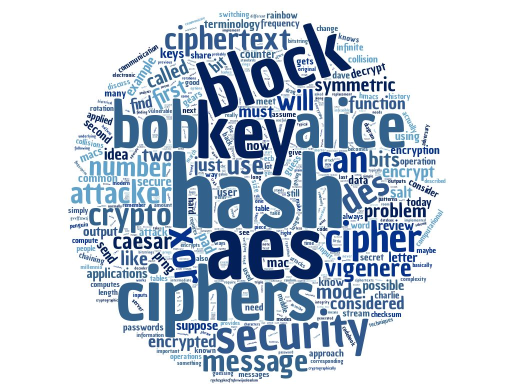

# Cryptography 100

### Topics
------

* Symmetric Crypto
* Historical Crypto
    * Caesar Cipher, Substitution Cipher, Vigenere Cipher
* Frequency Analysis
* Bitwise Operations
    * And (&), Or (|), XOR (^)
* One-Time Pad
* Psuedo-Random Number Generations (PRNGs)
* Stream Ciphers
* Computational Complexity
* Block Ciphers
    * DES, AES
* Modes of Operation
    * ECB, CBC, CTR, GCM
* OpenSSL
* Authentication
    * HMACs, CBC-MAC, MAC-then-Encrypt, Encrypt-then-MAC
* Hash Functions
* One-Way Functions
* Hash Collisions
* Rainbow Tables
* Salted Passwords

### Scripts
-----
* [rot_cipher (Python)] - Rotation Cipher
* [sub_cipher (Python)] - Substitution Cipher Using Frequency Analysis
* [ssl_bruteforce (Python)] - Bruteforce SSL Encryption 
* [hash_collisions (Python)] - Birthday Attack 
* [hmac_find (Python)] - HMAC Authentication 

[rot_cipher (Python)]: ./rot_cipher
[sub_cipher (Python)]: ./sub_cipher
[ssl_bruteforce (Python)]: ./ssl_bruteforce
[hash_collisions (Python)]: ./hash_collisions
[hmac_find (Python)]: ./hmac_find

### Assignments
------

* Create a rotational cipher in python.
* Create a substitution cipher utilizing frequency analysis in bash or python.
* Using OpenSSL, begin to understand block ciphers and the various modes of operation.
* Better understand hash functions by performing hash collisions.
* Create a script to test hashed message authentication codes (HMACs).

### Tools
------

* Python
* OpenSSL

### Command Line Things
------

* tr
* python interpreter
* OpenSSL