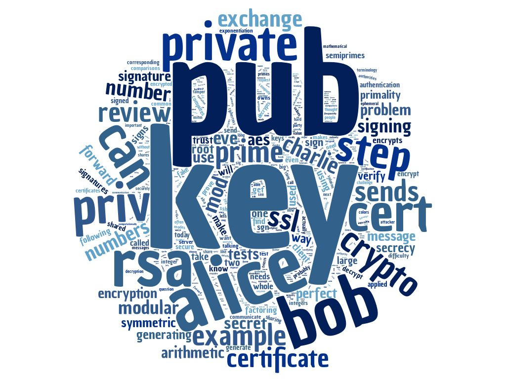

# Cryptography 200

### Topics
------

* Public Key Crypto
* Math Concepts
    * Primes, Factorization, Semiprimes, Modular Arithmetic, Exponentiation
* RSA Cryptosystem
    * p and q, n, phi
* Encryption and Decryption
* Primality Testing
* SSL/TLS
* Man-in-the-Middle Attacks
* Signatures - Authentication
* Certificates
    * Certificate Authorities (CAs)
    * Certificate Chains
* SSH
* Diffie-Hellman Key Exchange
* Ephemeral Keys
* Perfect Forward Secrecy

### Scripts
-----
* [cert_hunt (Python)] - Cert Hex to Integer

[cert_hunt (Python)]: https://github.com/TK05/SecureSet_2018/tree/master/cryptography_200/cert_hunt

### Assignments
------

* Find and examine secure website certificates.
* Create a public and private key using OpenSSL.
* Encrypt a message with a given public key and then encode.
* Generate a Certificate Signing Request (CSR) to be signed by a Root CA.
* Generate a secure connection for an Apache Web Server using a signed certificate and a given root certificate.
* Use ssh-keygen to create an RSA private key and enable login to a SSH server without a password.

### Tools
------

* Python
* Web Browser - Certificates
* OpenSSL
* Apache2

### Command Line Things
------

* openssl
    * genrsa, rsa, rsautl, req, x509
* base64
* a2enmod
* a2ensite
* /etc/apache2/sites-enabled/default-ssl.conf