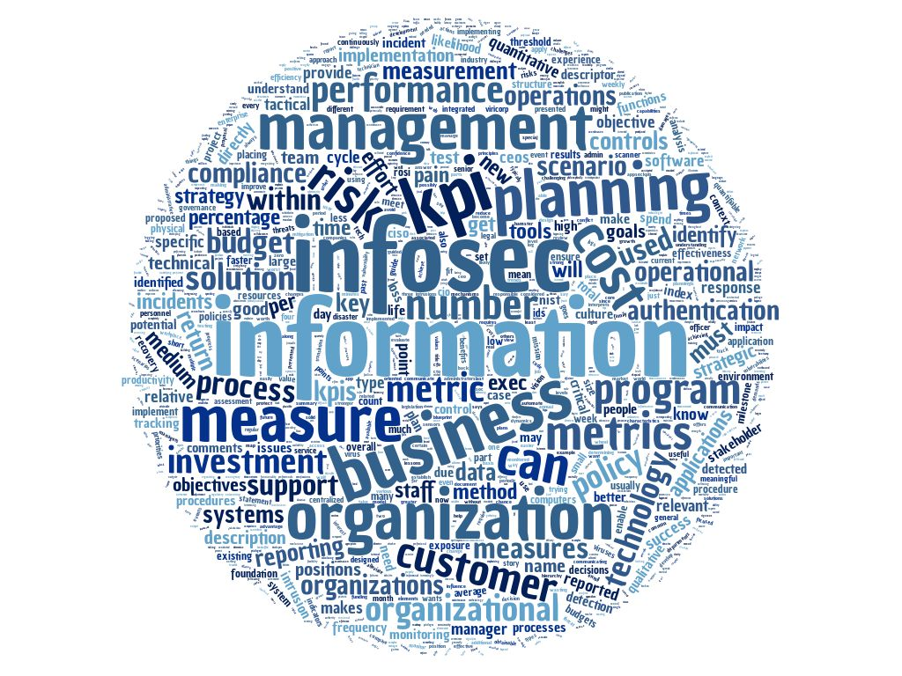

# Culture 200

### Topics
------

* Translation of Security for CEOs
* CEOs View of the Security World
* Operational Language and Strategies
* Security Metrics and RoSI (Cost vs. Profit)
* Consultants 101
* InfoSec as Part of Security Culture
* Governance and Planning
* Performance Measures
    * KPIs
* Structure and Hierarchy
* Organizational Structure and Information Security

### Assignments
------

* What is the key lessons to know about how to communicate with the Operations staff you support?
* How do your present metrics and RoSI/RoI that get positive actions from the C-Suite?
* What do you need to know about operations and what do they need to know about you?
* Develop KPIs.

### Tools
------

* Return on Security Investment (RoSI)
* SWOT Analysis
* SMART Goals
* NIST 800-55