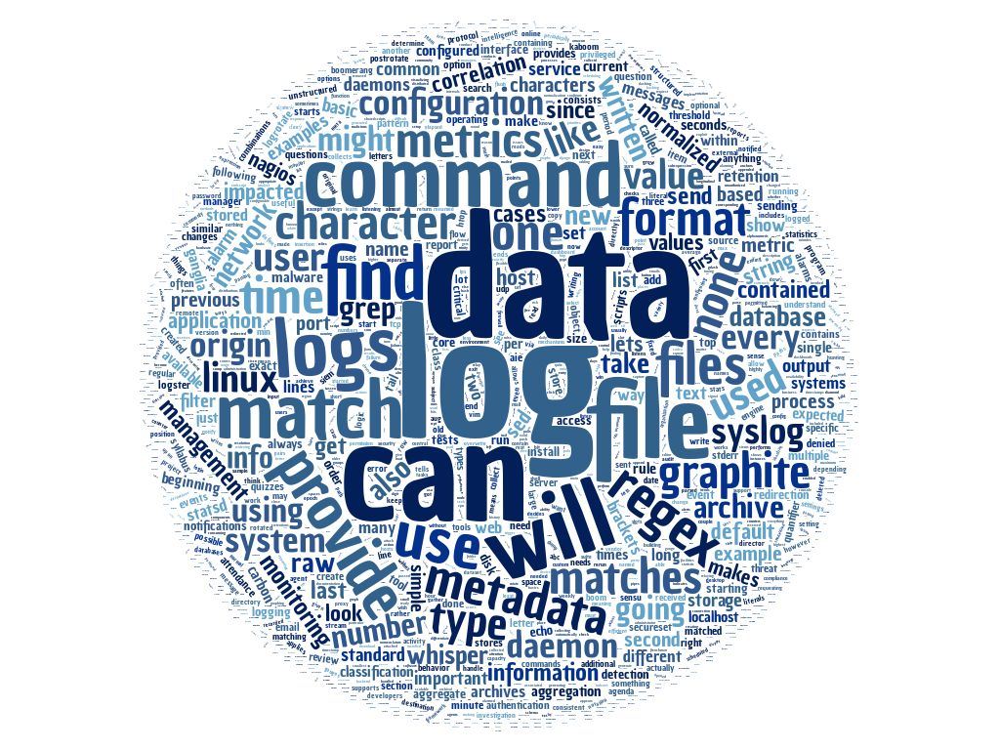

# Logs and Detection 100

### Topics
------

* The Tao of Network Security Monitoring
* The Security Process
* Security Information and Event Management (SIEM)
* 3 Components of a Logs Strategy
    * Network, User, Endpoint
* Introduction to IoCs
* Log Source Types
* Log Levels
* Raw Logs vs. Parsed Logs
* Databases
* Strategic Tuning
* Logs Capacity vs. Load
* Structured vs. Unstructured Data
* Normalization
* Types of Data
    * Contextual, Quantitative, Derived
* Datasets, Logic and Uses
* Regex101
* Data Masking
* Metadata
* Hunting
* Alarms vs. Reports
* Hardware and Software Components
* Architecture
* Life of a Log

### Assignments
------

* Retrieve, export and collect logs from workstation.
* Disover how to export or copy logs.
* Calculate expected storage requirements to get a feel for capacity planning.
* Research and explain retention policies for various compliance regulations - NERC-CIP, PCI-DSS 3.x, SOX, HIPAA
* Understand the LogRhythm application specifications data sheet.
* Create a number of practical regular expressions while taking into account steps and time.
* Chaining expressions using regex, grep, find, sed, etc.

### Tools
------

* Syslog
* SNMP
* LogRhythm
* Regular Expressions
* Event Viewer

### Command Line Things
------

* STDERR
* tail -f
* /var/log
* grep
* ls
* pipes
* sed