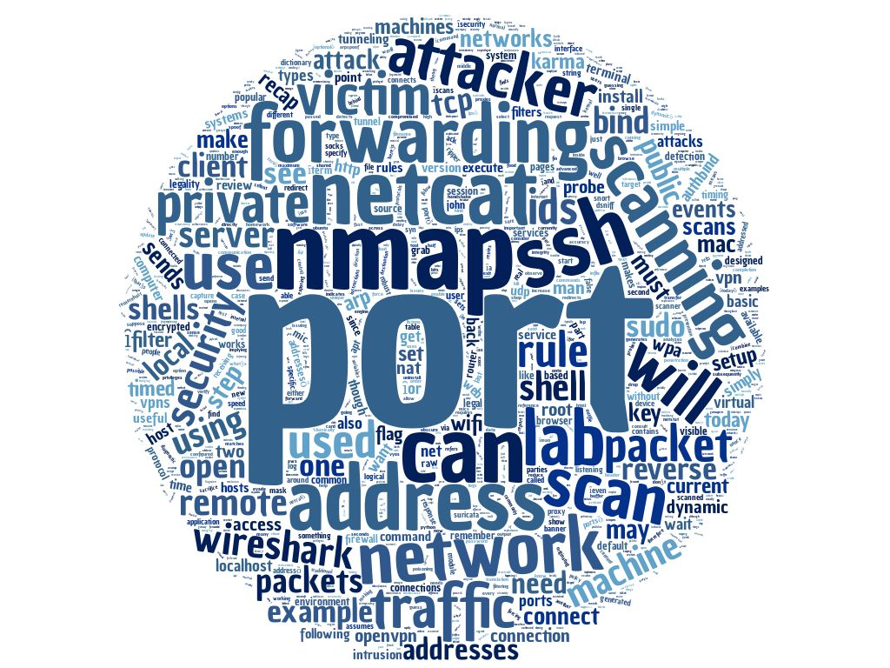

# Network Security 200

### Topics
------

* Netcat in Depth
* Wireshark Filters
* NAT
* Port Forwarding
    * netcat
    * SSH
        * local, remote, dynamic
* Public/Private Networks
* Virtual Private Networks
* OpenVPN
* Port Scanning
* Nmap
    * Legal Issues
* WPA
* Aircrack-ng
* John the Ripper
* Main-in-the-Middle Attacks
    * KARMA Attack
    * ARP-Spoofing
* Bind Shells
* Reverse Shells
* Intrusion Detection Systems
* Intrusion Prevention Systems
* Rule Writing

### Scripts
-----
* [port_scanner (Python)] - A Very Simple Port Scanner

[port_scanner (Python)]: /port_scanner

### Assignments
------

**Note: The majority of this class focused on building an environment from scratch which I detail on the Environment Lab page.**

* Use netcat to communicate between two machines behind two NAT boxes using a mutually visible in-between machine.
* [Environment Lab] - Setup
* [Environment Lab] - Vyos Source and Policy Routing
* Write a simple port scanner in Python.
* Exploit a nearby access point using aircrack-ng. 
* Play Man-in-the-Middle with arpspoof.
* [Environment Lab] - Snort Install and Basic Config
* Learn to write Snort rules and discovery scenarios. 

### Tools
------

* netcat
* Wireshark
* ssh
* OpenVPN
* Nmap
* John the Ripper
* aircrack-ng
* arpspoof
* Snort
* VyOS

### Command Line Things
------

* netcat, netcat traditional
* authbind
* ssh
* /etc/ssh/sshd_config
* nmap
* airmon-ng
* airodump-ng
* aireplay-ng
* aircrack-ng
* arpspoof
* dsniff