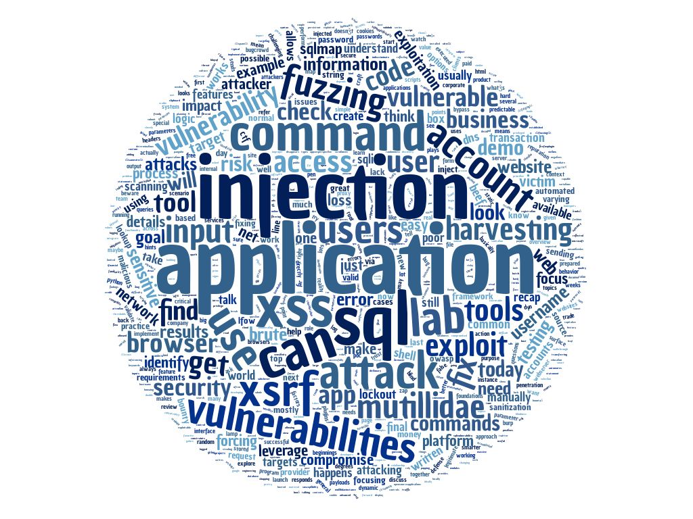

# Network Security 400

### Topics
------

* Vulnerabilities
    * AppSec Perspective
    * Targets
    * Impact and Risk
    * Fixing Issues
    * Corporate Reality
* Cross Site Scripting - XSS
    * Reflected
    * Stored or Persistent
* Mutillidae
* Username Harvesting
* Brute Forcing
* Fuzzing
* SQL Injection
    * Blind SQL Injection
* Sqlmap
* Cross Site Request Forgery (XSRF)
* Command Injection
* Client-Side Attacks
* Logic Attacks
* Cross Frame Scripting
* BeEF

### Assignments
------
**The goal of NET300 was to build a basic LAMP stack web app for simple signup/login/logout functionality to be exploited in NET400**

* Fuzz webapp for any potential XSS vulnerabilities.
* Automate fuzzing using either Burp or ZAP.
* Install and setup XAMMP and Mutillidae.
* Automated harvesting attack using Burp.
* Explore potential bug bounties.
* SQL injection using Burp/ZAP and sqlmap.
* CSRF exploit on Mutillidae.
* Find some websites vulnerable to XFS/Clickjacking.
* Use BeEF against own hosts to gain a comfortable level of familiarity with the tool. 
* NET400 CTF

### Tools
------

* Burp
* ZAP
* Mutillidae
* sqlmap
* BeEF

### Command Line Things
------

* sqlmap