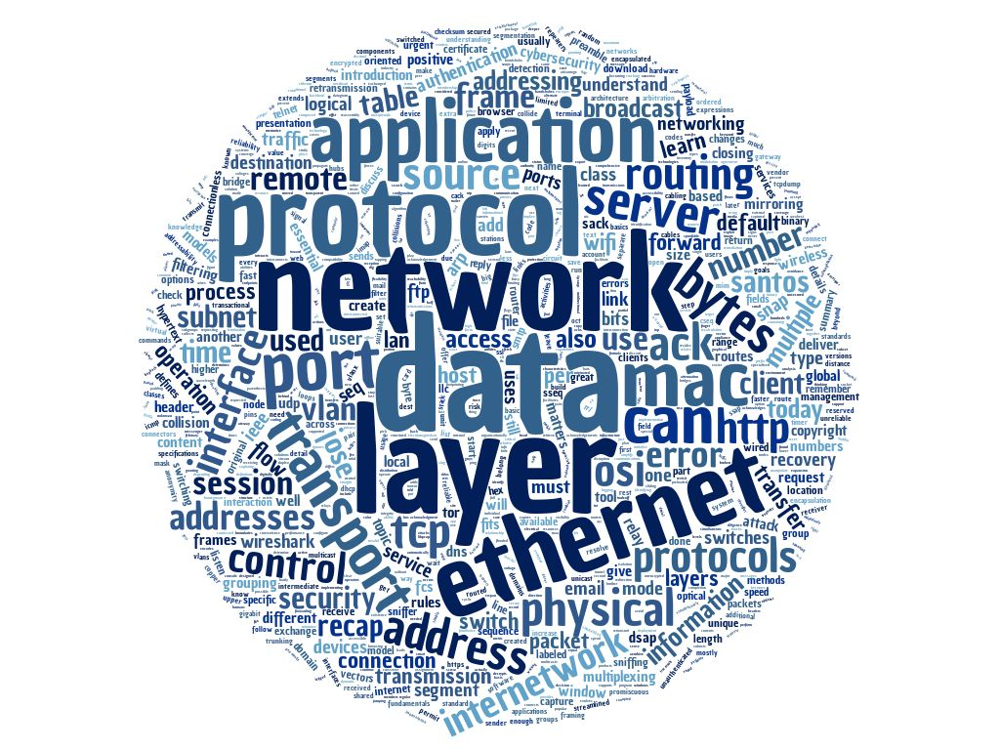

# Network Security 100

### Topics
------

* TCP/IP Layers
    * Application, Transport, Internetwork, Network Interface
* Data Encapsulation
* Ethernet Framing
* VLANs
* Network Layer Addressing
* IP Packet Structure
* Network Classes
* TCP and UDP Basics
* IP Routing
* Multiplexing
* TCP Sequence Numbers
* Application Protocols
    * HTTP, HTTPS, TOR, FTP, SMTP, TLS/SSL, Telnet
* Logical Operators
* Ethernet Promiscuous Mode
* Port Mirroring
* Wireshark
    * Capturing
    * Filtering

### Assignments
------

* Explore the layers of the TCP/IP model to fully understand their operation.
* Pair protocol knowledge with ability to record/analyze network traffic ala security forensics. 
* Using wireshark, identify; DHCP, ARP, DNS, TCP (3-way handshake), HTTP (GET and OK messages).
* Understand relationship between IP address, subnet mask, default gateway and routing protocols.
* Understand IP layer interaction with Transport and Internetwork.
* Study basics of HTTP/FTP/POP/DNS/Telnet.
* Subnet a /24 network into 6 different networks based on demands.
* Use nslookup and dig on various domains and records.
* Use given pcap file to find and extract data from various packets and protocols. 
* Utilizing a looking glass, find AS systems and BGP routing.

### Tools
------

* Wireshark

### Command Line Things
------

* /etc/hosts
* /etc/resolv.conf
* nslookup
* dig