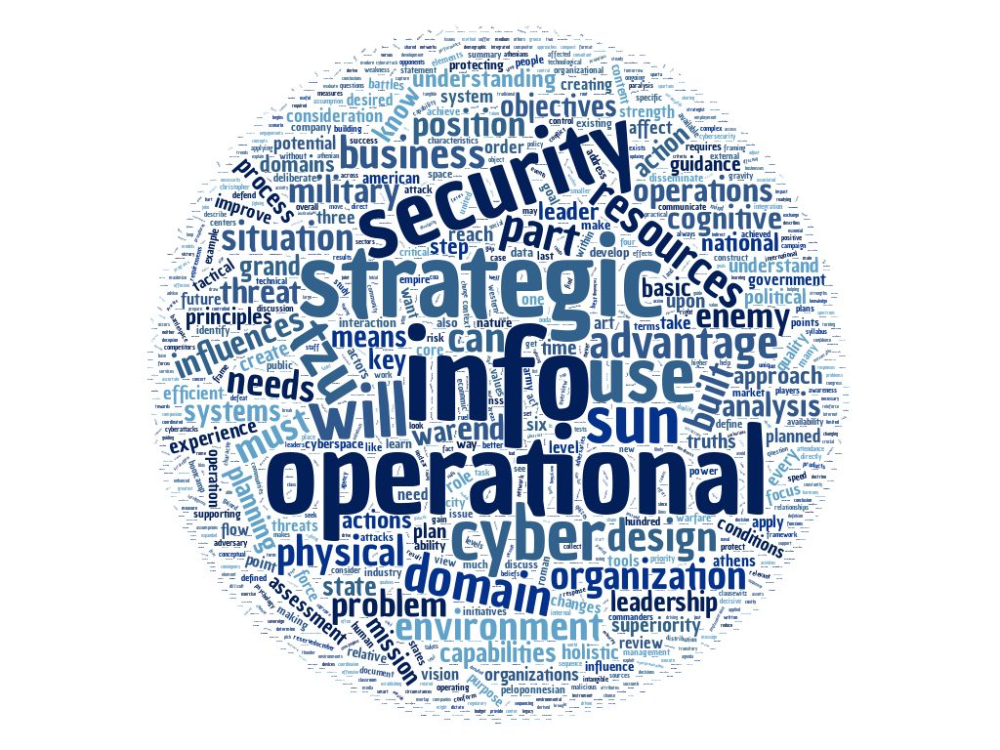

# Strategy and Analysis 100

### Topics
------

* Strategy Defined
* Ends, Ways and Means
* Psychology of Strategy
* Six Principles of Sun Tzu & the Art of Business
* Strategy vs. Analysis
* Strategic Plans
    * National Security Strategy
* Strategic Leadership
    * Qualities of a Leader
* Products of a Strategic Leader
* Analyzing your Opposition
    * Criminal Psychology
        * Internal Threats
        * External Threats
* Operational Design Methodology
* Elements of Operational Design
* Information Operations Defined
* The Decisions-Making Cycle
* The Information Environment
    * Cyberattack, Cyberwar, Cyberespionage
    * Cognitive, Information, Physical
* Information Superiority
* Information Domain
    * Quality, Reach, Interaction
    * Needs, Position, Situation
* Information Advantage

### Assignments
------

* 5 minute class presentation about a cybersecurity current event - WannaMine.
* Research, review and discuss the recently released Cybersecurity portion of the National Security Strategy.
* Group Project: Develop a strategic plan for Blue Origin. Including; mission & vision, value statements, external environment analysis, key players and partners, unique organizational factors, SWOT analysis, GAP analysis, strategic iniatives, campaign plan, courses of action, SMART goals and assessment tools.
* Group Project: Build an information warfare strategy for Kyrgzstan in regards to Chinese and Russian influences. Apply critical thinking in a cultural context to build an understanding of the information environment. Understand the tools that can be used in the information environment. Understand how effects are combined to achieve national interests. 

### Tools
------

* SWOT Analysis
* Gap Analysis
* SMART Goals 
* RoSI
* Measure of Performance (MOP)
* Measure of Effects (MOE)
* Measure of Success    
