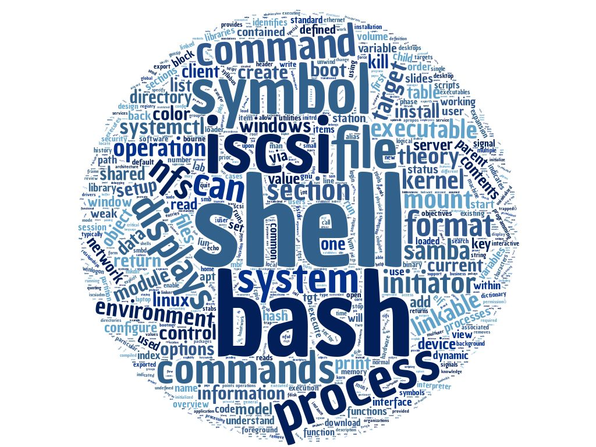

# System Security 100

### Topics
------

* Examine Linux Processes in Detail
    * View, Start, Stop Running Processes
* Disk Partitioning
* Linux File System
* Linux Kernel
* How to Tune a Kernel
* Fundamental Tenet of UNIX
* System Buffers
* Sysctl
* /sys File System
* System Startup
    * Boot Process
    * Linux and Windows
* Bash Shell
    * Theory
    * Configuration
    * Operation
* Aliases
* Symbolic Links
* Command Redirection
* SUID/GUID/Sticky Bits
* The Evolution of the Software Practitioner
* Software Development Life Cycle - SDLC
* Programming Constructs
* Nassi-Schneiderman Charts
* Anatomy of a Python Script
* Documentation Template
* OS Package (System Interfaces)
* Importance of Staying Current
* Executable and Linkable Format (ELF)
* Shared Libraries
* Logical Volume Manager (LVM)
* ISCSI and SCSI Model
* Network File System (NFS)
* Samba Model

### Scripts
-----

* [tcplookup (Bash)] - Convert TCP Connections to Nslookup Output
* [pslist (Bash)] - ps -aef Output Without Using ps -aef
* [setuid_finder (Python)] - Find Setuid and World Writeable Files

[tcplookup (Bash)]: ./tcplookup
[pslist (Bash)]: ./pslist
[setuid_finder(Python)]: ./setuid_finder

### Assignments
------

* Decomposing initrd.
* Modifying kernel parameters.
* Bash script to scrap ip's from /proc/self/net/tcp and do an nslookup on them.
* Bash script to replicate ps -aef command without using ps -aef.
* Write a script to find all setuid and world writeable files. 
* Create, discover and share a local partitioned drive with a remote host.

### Tools
------

* kernel modules
* GRUB
* Bash
* Python
* LVM
* ISCSI
* NFS
* Samba

### Command Line Things
------

* /proc
    * cpuinfo, meminfo, filesystems, diskstats, net
* /sys/class
* /boot
* /etc
* /bin
* /sbin
* /usr
* /var/logs
* /dev
* /etc/profile
    * .bash_profile, .bash_login, .profile
* type
* alias/unalias
* if, for, while
* hash
* updatedb, locate
* history
* $PATH
* kill
* ldd
* ldconfig
* pvcreate, pvdisplay, pvscan
* vgcreate, vgdisplay, vgscan
* lvcreate, lvdisplay, lvscan