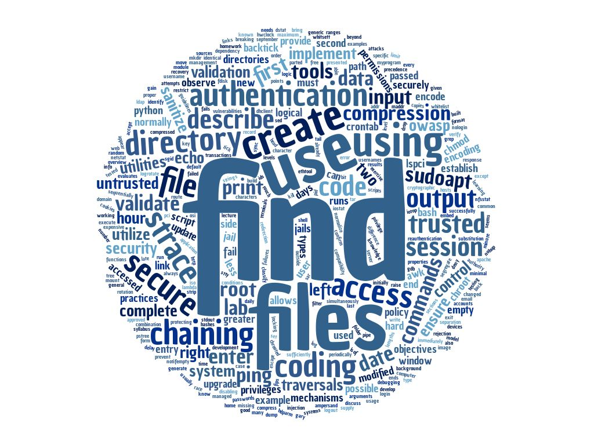

# System Security 200

### Topics
------

* OWASP Secure Coding Practices
* Input Validation
* Authentication and Passwords
* Session Management
* Cryptopgrahic Properties
* General Coding Practices
* Encoding
* Command Chaining
* /bin and /sbin Tools and Utilities
* Debugging Tools

### Assignments
------

* Describe OWASP Secure Coding Practices
* Create and use python filter and lambda functions
* Describe and create directory traversals
* Describe and implement chroot jails
* Describe and implement command chaining, using &, && and !
* Use the back tick and $() to embed code

### Tools
------

* Python
* Bash
* gcc
* gdb
* strace

### Command Line Things
------

* /bin
    * awk, crontab, ed, date, dstat, df, du, file, find, free
    * iotop, ip, route, od, kill, logrotate, ln
    * lsof, ping, pstree, nohup, sar, sed, tail
    * tee, time, top/htop, ss, stty, touch, tr, true/false
* /sbin
    * dmesg, ifconfig, dhclient, ethtool, genisoimage, hdparm
    * hwclock, fdisk, lspci, mii-tool, parted, smartd, sync
* gcc
* xxd
* gbd
* strace
* strings
* screen