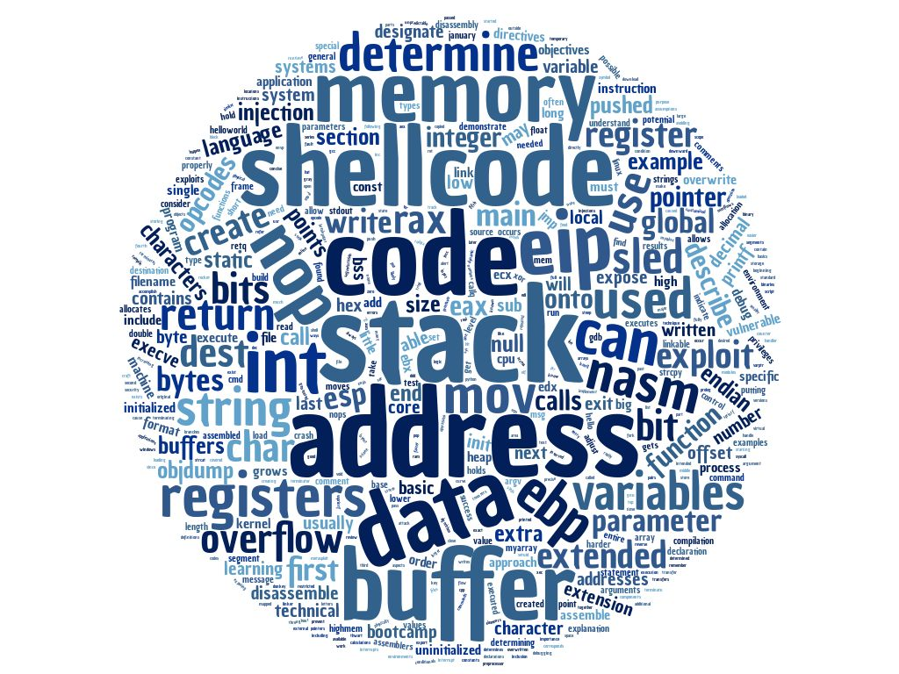

# System Security 300

### Topics
------

* C Code 
* Memory Layout
    * Heap
    * Stack
    * Registers
* AT&T vs NASM
* Big vs Little Endian
* Basic Assembly (NASM)
* Assembly Compilation Process
* Buffer Overflows
* Opcode/Shellcode
* System Calls
* Execve
* Code Injection
* Integer Overflow
* Stack Calls
* Function Calls

### Scripts
-----

* [tcplookup (Bash)] - Convert TCP Connections to Nslookup Output
* [pslist (Bash)] - ps -aef Output Without Using ps -aef
* [setuid_finder (Python)] - Find Setuid and World Writeable Files

[tcplookup (Bash)]: ./tcplookup
[pslist (Bash)]: ./pslist
[setuid_finder(Python)]: ./setuid_finder

### Assignments
------

* Demonstrate a full buffer overflow with shellcode injection.

### Tools
------

* nasm
* ld
* objdump

### Command Line Things
------

* nasm
* ld
* objdump